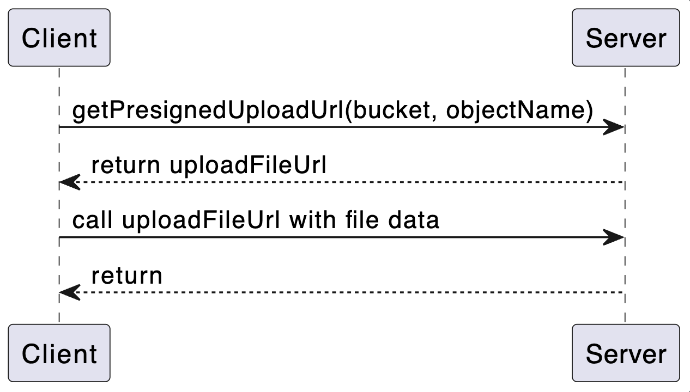
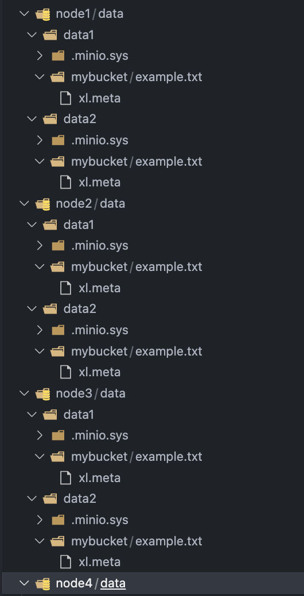

# Mô hình MinIO Cluster tối ưu nhất

## ✨ Mục tiêu

Mô tả mô hình MinIO cluster tối ưu cho môi trường **production**, hỗ trợ **high availability**, **tính bền dữ liệu**, và **hiệu suất cao**.

---

## ✨ Mô hình khuyến nghị:

### 📊 Cấu trúc tổng quan:

- **Tối thiểu 4 node** (số chẳn, khuyến nghị 4 hoặc nhiều hơn).
- Mỗi node có **từ 2 đến N ổ đĩa** tốc độ cao (SSD/RAID).
- Sử dụng **reverse proxy/load balancer (NGINX, HAProxy, Traefik)**.
- Chạy MinIO với **distributed mode** và **erasure code**.
- Hỗ trợ TLS/SSL và monitoring.

---

## 📏 Ví dụ cài đặt (4 nodes x 4 disks):

```bash
minio server http://minio{1...4}/data{1...4} --console-address ":9001"
```

---

## ✅ Lợi ích của mô hình:

| Tiêu chí                   | Mô tả                                                                      |
| -------------------------- | -------------------------------------------------------------------------- |
| **High Availability (HA)** | Có thể mất 1 hoặc nhiều node/ổ đĩa mà không mất dữ liệu.                   |
| **Erasure Code**           | MinIO sử dụng mã hóa phân mảnh giúp bảo vệ dữ liệu hiệu quả.               |
| **Scalable**               | Có thể dễ dàng mở rộng thêm node/ổ đĩa.                                    |
| **Self-healing**           | Khi có lỗi, MinIO tự động kiểm tra và phục hồi dữ liệu.                    |
| **Performance**            | Song song hóa truy cập giúp hiệu suất cao hơn object storage thông thường. |

---

## 📈 Khuyến nghị cấu hình nâng cao:

| Mục                    | Khuyến nghị                                          |
| ---------------------- | ---------------------------------------------------- |
| **TLS/SSL**            | Bảo mật khi truyền dữ liệu.                          |
| **Monitoring**         | Dùng Prometheus, Grafana để theo dõi cluster.        |
| **Load balancer**      | Round-robin, health check (NGINX/HAProxy/Traefik).   |
| **Persistent volumes** | Ổ đĩa vật lý/volume bền vững (EBS, GlusterFS,...).   |
| **Auto restart**       | Docker `restart: always` hoặc chạy trong Kubernetes. |
| **Gateway mode**       | Khi tích hợp backend khác (S3, NAS, GCS,...).        |

---

## ⚠ Lưu ý:

- **Tối thiểu 4 ổ đĩa** để đạt mã hóa phân mảnh hiệu quả.
- **Mỗi ổ đĩa phải độc lập**, không chia sẻ giữa các node.
- **Tăng node/ổ đĩa theo cặp** (để cân bằng cluster).

---

## 🔗 Gợi ý:

- Dùng [MinIO Operator](https://min.io/docs/minio/kubernetes/upstream/index.html) nếu triển khai trên Kubernetes.
- Kết hợp cùng [mc](https://min.io/docs/minio/linux/reference/minio-mc.html) CLI để quản lý bucket, replication, user, IAM.

## Tổng kết: Mô hình MinIO Cluster tối ưu nhất

- Số node: **4 hoặc 8**
- Mỗi node: **2 disks trở lên**
- **Tổng số ổ đĩa chia hết cho 2**, để tận dụng hiệu quả tính năng Erasure Code (EC).
- Dùng Load Balancer (ví dụ: **NGINX, HAProxy**) để phân phối lưu lượng.
- Áp dụng **TLS** cho bảo mật và sử dụng **reverse proxy** nếu triển khai public.
- Giám sát và cảnh báo: tích hợp **Prometheus + Grafana** với **MinIO Exporter**.
- Redundancy: Tối thiểu **n/2 + 1 nodes** cần hoạt động để giữ cụm ổn định.

---

# Setup mô hình MinIO Cluster với NGINX bằng Docker

## 1. Cấu trúc thư mục dự án

```
.
├── docker-compose.yml
├── nginx
│   └── nginx.conf
├── node1
│   └── data
│       ├── data1
│       └── data2
├── node2
│   └── data
│       ├── data1
│       └── data2
├── node3
│   └── data
│       ├── data1
│       └── data2
├── node4
│   └── data
│       ├── data1
│       └── data2
```

## 2. Mô tả hệ thống

MinIO được triển khai theo mô hình distributed với 4 nodes, mỗi node sử dụng 2 disks (data1 và data2). NGINX được sử dụng như một Load Balancer để phân phối request đến các node MinIO.

## 3. Cấu hình `docker-compose.yml`

### Các phần cấu hình chính:

- `image`: chỉ định image MinIO hoặc NGINX cần sử dụng.
- `container_name`: tên container, giúp dễ quản lý.
- `volumes`: ánh xạ thư mục chứa dữ liệu trên host vào container.
- `networks`: khai báo container thuộc network nào.
- `environment`: cấu hình biến môi trường, gồm user/password quản trị.
- `command`: cấu hình cụm MinIO cluster gồm nhiều node và nhiều disk.
- `expose`: mở port nội bộ container (không publish ra ngoài).
- `ports` (trong nginx): ánh xạ cổng từ host đến container.
- `depends_on`: đảm bảo NGINX chỉ khởi động sau khi các MinIO container đã chạy.

### Cấu hình cụ thể

```yaml
services:
  minio1:
    image: minio/minio
    container_name: minio1
    volumes:
      - ./node1/data/data1:/data1
      - ./node1/data/data2:/data2
    networks:
      - minio_net
    environment:
      MINIO_ROOT_USER: minioadmin
      MINIO_ROOT_PASSWORD: minioadmin
    command: server http://minio{1...4}/data{1...2} --console-address ":9001"
    expose:
      - "9000"
      - "9001"

  minio2:
    image: minio/minio
    container_name: minio2
    volumes:
      - ./node2/data/data1:/data1
      - ./node2/data/data2:/data2
    networks:
      - minio_net
    environment:
      MINIO_ROOT_USER: minioadmin
      MINIO_ROOT_PASSWORD: minioadmin
    command: server http://minio{1...4}/data{1...2} --console-address ":9001"
    expose:
      - "9000"
      - "9001"

  minio3:
    image: minio/minio
    container_name: minio3
    volumes:
      - ./node3/data/data1:/data1
      - ./node3/data/data2:/data2
    networks:
      - minio_net
    environment:
      MINIO_ROOT_USER: minioadmin
      MINIO_ROOT_PASSWORD: minioadmin
    command: server http://minio{1...4}/data{1...2} --console-address ":9001"
    expose:
      - "9000"
      - "9001"

  minio4:
    image: minio/minio
    container_name: minio4
    volumes:
      - ./node4/data/data1:/data1
      - ./node4/data/data2:/data2
    networks:
      - minio_net
    environment:
      MINIO_ROOT_USER: minioadmin
      MINIO_ROOT_PASSWORD: minioadmin
    command: server http://minio{1...4}/data{1...2} --console-address ":9001"
    expose:
      - "9000"
      - "9001"

  nginx:
    image: nginx:latest
    container_name: minio-nginx
    ports:
      - "9000:9000"
      - "9001:9001"
    volumes:
      - ./nginx/nginx.conf:/etc/nginx/nginx.conf:ro
    depends_on:
      - minio1
      - minio2
      - minio3
      - minio4
    networks:
      - minio_net

networks:
  minio_net:
    driver: bridge
```

## 4. Cấu hình file `nginx.conf`

### Mục đích:

- Sử dụng `upstream` để gom các MinIO nodes lại phục vụ cho API (port 9000) và giao diện console (port 9001).
- Reverse proxy nhận request từ client và forward tới các MinIO container tương ứng.

### Cấu hình cụ thể:

```nginx
events {}

http {
  upstream minio_api {
    server minio1:9000;
    server minio2:9000;
    server minio3:9000;
    server minio4:9000;
  }

  upstream minio_console {
    server minio1:9001;
    server minio2:9001;
    server minio3:9001;
    server minio4:9001;
  }

  server {
    listen 9000;
    location / {
      proxy_set_header Host $http_host;
      proxy_set_header X-Real-IP $remote_addr;
      proxy_set_header X-Forwarded-For $proxy_add_x_forwarded_for;
      proxy_set_header X-Forwarded-Proto $scheme;
      proxy_pass http://minio_api;
    }
  }

  server {
    listen 9001;
    location / {
      proxy_set_header Host $http_host;
      proxy_set_header X-Real-IP $remote_addr;
      proxy_set_header X-Forwarded-For $proxy_add_x_forwarded_for;
      proxy_set_header X-Forwarded-Proto $scheme;
      proxy_pass http://minio_console;
    }
  }
}
```

## 5. Khởi động hệ thống

```bash
docker-compose up -d
```

## 6. Truy cập giao diện quản lý

- MinIO Console: [http://localhost:9001](http://localhost:9001)
- API S3: [http://localhost:9000](http://localhost:9000)

# Kiểm thử

## Thực hiện updaload file lên minio theo cơ chế presigned

### Cơ chế presigned



### Dưới đây là đoạn code để upload 1 file example.txt với bucket "mybucket" lên Minio

```
const fs = require('fs');
const axios = require('axios');
const Minio = require('minio');

// Tạo client MinIO
const minioClient = new Minio.Client({
    endPoint: 'localhost',
    port: 9000,
    useSSL: false,
    accessKey: 'minioadmin',
    secretKey: 'minioadmin',
    region: 'us-east-1', // bắt buộc!
    pathStyle: true // đảm bảo hoạt động với proxy nginx
});


/**
 * Upload file
*/

// Hàm để lấy presigned URL
function getPresignedUrl(bucketName, objectName, expiry = 60 * 60) {
    return new Promise((resolve, reject) => {
        minioClient.presignedUrl('PUT', bucketName, objectName, expiry, function (err, presignedUrl) {
            if (err) {
                console.error('Lỗi khi tạo presigned URL:', err);
                return reject(err);
            }
            console.log('Presigned URL: ', presignedUrl);
            resolve(presignedUrl);
        });
    });
}

const filePath = './example.txt'; // đường dẫn đến file local

async function uploadFile(presignedUrl, filePath) {
    const fileStream = fs.createReadStream(filePath);
    try {
        const response = await axios.put(presignedUrl, fileStream, {
            headers: {
                'Content-Type': 'application/octet-stream'
            }
        });
        console.log('Upload thành công!');
    } catch (err) {
        console.error('Upload thất bại:', err);
    }
}

async function upload() {
    const bucketName = 'mybucket';
    const objectName = 'example.txt';
    const filePath = './example.txt';

    try {
        const url = await getPresignedUrl(bucketName, objectName);
        console.log('URL đã lấy:', url);
        await uploadFile(url, filePath);
    } catch (err) {
        console.error('Có lỗi xảy ra:', err);
    }
}

upload();

```

### Sau khi thực hiện upload file, chúng ta sẽ kiểm tra các thư mục data trên các node

- Chúng ta sẽ thấy rằng, file example.txt được lưu trên tất cả các ổ của các node
- Thực chất là mỗi node sẽ lưu 1 phần nhỏ của file example.txt



### Sau đó chúng ta có thể kiểm tra cơ chế restore của minio

#### TH1: Ta giả lập 1 node bị gặp sự cố và bị shutdown đột ngột

- Khi gọi API get file, ta vẫn nhận được file hoàn chỉnh

#### TH2: Ta giả lập trường hợp file xl.meta trên một node bị hỏng (mất)

- Khi gọi API get file, ta vẫn nhận được file hoàn chỉnh.
- Không những thế file xl.meta ta vừa bị mất còn được tái tạo lại
